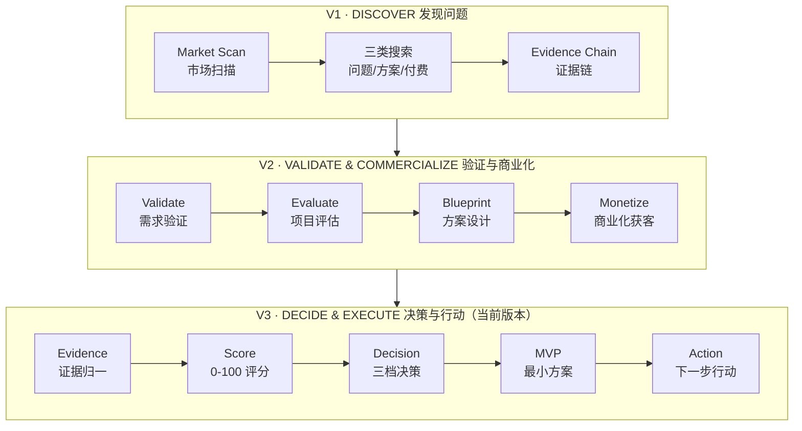
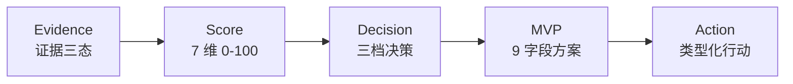
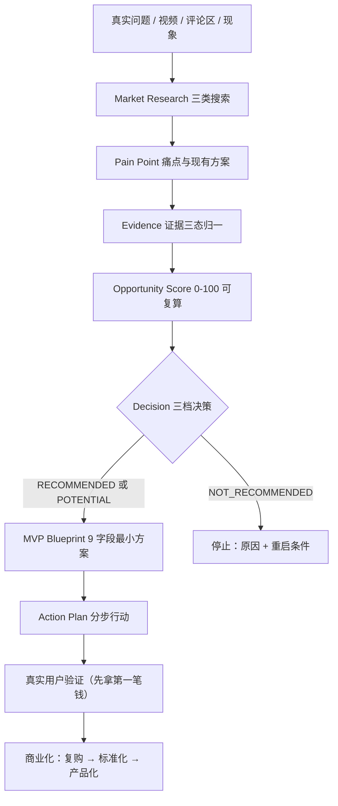

<div align="center">

# 🔭 Market Scout

### AI Market Opportunity Discovery & Validation Skill
### AI 市场机会发现 · 需求验证 · 项目评估 · 商业化决策 Skill

把一个模糊想法，跑成 **「是否值得做的结论 + 最小可行方案 + 下一步行动」**。

[](./CHANGELOG.md)
[](./LICENSE)


**Evidence → Score → Decision → MVP → Action**

[⬇ 下载 V3.0.0](./releases/market-scout-v3.0.0.zip) · [🚀 安装](#-安装-v3) · [⚡ 快速开始](#-快速开始) · [🗺 版本演进](#-v1--v2--v3-版本演进) · [📁 项目结构](#-项目结构)

</div>

---

## 🎯 这是什么

Market Scout 是一个 **纯 Markdown 编写的 AI Agent Skill（方法论文档包）**。安装到支持 Skill 的 AI 客户端后，Agent 就获得一整套「市场机会发现 → 需求验证 → 项目评估 → MVP 设计 → 商业化决策」的工作流。

> 它 **不是「AI 创业点子生成器」**，不会凭空给你编项目。
> 它从**真实问题和真实市场证据**出发，帮你发现需求、验证机会、评估项目、设计 MVP，并决定下一步具体行动。

它的思考顺序是：

```
先问：谁遇到了什么问题？为什么愿意付钱解决？
再问：AI 能否让我更低成本、更快地解决它？
最后：值不值得做？第一版做什么？今天先做什么？
```

## 🧭 可以用在哪些方面

| | |
|---|---|
| 🔍 **Market Research**<br>市场研究：三类搜索（问题 / 现有方案 / 付费行为）交叉验证 | 💡 **Opportunity Discovery**<br>发现创业机会：从日常现象里找出可验证的商业机会 |
| 🎯 **Pain Point Discovery**<br>发现真实痛点：区分「有点不方便」和「愿意付钱解决」 | 🔎 **Problem Validation**<br>验证需求真假：需求强度 6 信号 + 证据三态，拒绝自我感动 |
| 🏆 **Competition Analysis**<br>竞争与切入分析：不数竞品数量，只看「还有没有切入空间」 | 💰 **Monetization**<br>商业化：商业模式、定价锚、获客渠道、第一批客户 |
| 🧩 **MVP Planning**<br>最小可行产品：9 字段方案，默认「人工 + AI」先卖结果 | 🚀 **Action Planning**<br>行动计划：按机会类型生成分步行动，明确「今天做什么」 |

**可以分析的输入**：短视频内容、评论区、用户反馈、社交媒体帖子、现实生活中观察到的问题、已有产品、市场需求、创业想法……

**最终帮你回答一个问题：这件事，到底值不值得做？**

## 🗺 V1 → V2 → V3 版本演进



- **V1 解决「发现问题」**，V2 解决「验证 + 怎么赚钱」，**V3 解决「到底做不做、现在做什么」**。
- 三个版本是**增量叠加**关系：V3 完整包含 V2、V1 的全部方法、模板与示例，没有删除任何旧能力。

### V1 — DISCOVER 发现问题（基础版）

V1 是 Market Scout 的基础版本，核心是**从真实内容和真实问题中发现值得关注的市场机会**：

- Market Scan 市场扫描、Problem Card 问题卡片
- Problem / Solution / Payment 三类搜索
- Evidence Chain 证据链（原始证据 → 观察 → 推断 → 假设 → 验证）
- Quick / Research / Execution 三种工作模式、基础机会判断

> 一句话：**V1 帮你「发现问题」。**

### V2 — VALIDATE & COMMERCIALIZE 验证与商业化

V2 在 V1 之上建立了完整的机会验证与商业化流水线：

```
Find 发现 → Validate 需求验证 → Evaluate 项目评估 → Blueprint 方案设计 → Monetize 商业化
```

- **Validate**：需求强度 6 信号、三层目标用户、替代成本、付费理由链 JTBD
- **Evaluate**：7 维加权评分 0-100（可手工复算）、GO / VALIDATE_FIRST / NO_GO 三档结论、7 条致命红旗
- **Blueprint**：产品形态 Level 1-5、MoSCoW、MVP 五项、最小验证实验
- **Monetize**：付费方画像、Offer 三档、商业模式库、可解释定价、首批 10 客户、GTM 路径

> 一句话：**V2 回答「有没有真实需求？有没有市场？能不能做？怎么赚钱？」**

### V3 — DECISION LAYER 决策层（⭐ 当前版本，重点）

V3 最大的变化不是多加几个功能，而是在 V2 的分析流水线之上，增加了一层 **Decision Layer（决策层）**：



> **V2 帮你把机会分析清楚；V3 帮你决定这个机会到底值不值得做，以及下一步具体怎么做。**

## ✨ V3 核心升级（5 个新模块）

| 模块 | 能力说明 |
|---|---|
| **01 · Market Evidence 市场证据** | 每条关键结论强制区分三态：✅ **Evidence**（找到的公开信息，可引用来源）／🟡 **Inference**（基于证据的推导，最高 7 分）／⚪ **Unknown**（信息不足，按 0 分计）。证据不足时直接**熔断**：不评分、不编造，并说明缺什么、去哪补。 |
| **02 · Opportunity Score 机会评分** | 7 维加权出 **0–100 分**：需求 15% · 痛点 15% · 竞争切入 15% · **变现 20%** · 开发 15% · 获客 10% · AI 优势 10%；每维再拆 3-4 个子信号，计算式必须写出、**可手工复算**，不是 AI 主观分。 |
| **03 · Decision 机会决策** | 由「总分 + 门槛 + 红旗 + 证据充分度」共同决定：🟢 **RECOMMENDED** 推荐继续做／🟡 **POTENTIAL** 有潜力但需先验证／🔴 **NOT_RECOMMENDED** 不建议投入；每个决策必须带编号 Why 列表，每条理由绑定证据。 |
| **04 · MVP Blueprint 最小方案** | 值得做才生成，固定 9 字段：Product / Target User / Core Problem / Core Value / Must Have（≤3）/ Nice to Have / **Do Not Build** / Build Difficulty / Recommended Stack。默认「人工 + AI」先卖结果，而不是一上来开发复杂产品。 |
| **05 · Action Plan 行动计划** | 按 5 类机会（企业工具 / 个人工具 / AI Agent / 本地服务 / 数字产品）生成**不同的**分步计划，每步含「目标 · 做什么 · 成功标准 · 失败转向」，结尾给出 1-3 个「今天就能做」的动作。 |

> 五个模块严格按 **Evidence → Score → Decision → MVP → Action** 顺序执行，前一步不达标，后一步不启动。

## 🔄 V3 完整闭环（一张图看懂）



> 这张图就是 Market Scout 的世界观：**不是让 AI 给你编创业项目，而是从真实需求出发，一步一步走到执行。**

## 📺 使用示例（均来自仓库 examples，演示数据）

### 示例 1：🟢 值得做 —— 本地小店小红书文案代做（78/100）

> 完整示例见 [`examples/v3-decision-run.md`](./examples/v3-decision-run.md)

```
输入：「很多小店主想在小红书获客但不会写种草文案，代运营一个月好几千，
      我用 AI 帮他们写，值不值得做？」
  ↓ Evidence   重复求助 + 代运营 2000-5000 元/月报价（Evidence），付费意愿为 Inference
  ↓ Score      需求80 痛点77 竞争切入70 变现80 开发88 获客70 AI优势78
  ↓           = 78/100（计算式可复算），红旗 R1-R7 均未命中
  ↓ Decision   🟢 RECOMMENDED（需求/变现门槛均达标，证据 Partial）
  ↓ MVP        L1 人工+AI，【当前不需要开发】，每月 8 条成品图文包
  ↓ Action     LOCAL_SERVICE 路径：3 家免费样品 → 199 元首月收款 → 复购标准化
结果：今天就做出 3 条品类样品、列出 20 家目标店、谈 3 家免费试做。
```

### 示例 2：🔴 不建议投入 —— AI 会议纪要工具（48/100）

> 完整示例见 [`examples/v3-crowded-market.md`](./examples/v3-crowded-market.md)

```
输入：「开会软件都自带 AI 会议纪要了，我再做一个还有机会吗？」
  ↓ Competition 切入空间四问：巨头免费内建（Evidence）、未抓到用户抱怨（Unknown）、
  ↓                        细分方向也已有产品 → 无有证据的切入空间，维度封顶 40
  ↓ Score       = 48/100；红旗 R5 命中（巨头免费碾压且无结构性差异）
  ↓ Decision    🔴 NOT_RECOMMENDED —— 判负理由不是「竞争激烈」，而是「没有切入空间」
  ↓ Action      不生成 MVP；只保留一个验证动作：访谈 5 位重度用户找明确缺口
教学点：竞品多 ≠ 判死，竞品少 ≠ 蓝海；V3 永远只评「切入空间」。
```

> 更多完整流水线示例：[`examples/full-pipeline-v2.md`](./examples/full-pipeline-v2.md)（74 分为何仍是 POTENTIAL）、[`examples/real-world-problem.md`](./examples/real-world-problem.md)、[`examples/comment-analysis.md`](./examples/comment-analysis.md)、[`examples/video-analysis.md`](./examples/video-analysis.md)。

## ⬇ Download

### Latest Version：Market Scout V3.0.0（当前版本）

- 📦 **[market-scout-v3.0.0.zip](./releases/market-scout-v3.0.0.zip)**（仓库内正式安装包，解压后顶层为 `market-scout/` 目录）
- 历史版本变更见 [CHANGELOG.md](./CHANGELOG.md)
- 推送到 GitHub 后，也可以在仓库的 **Releases** 页面基于同一文件创建正式 Release（当前仓库内安装包以 `releases/` 目录为准）。

## 🚀 安装 V3

> 以下安装方式与 [`USER_GUIDE.md`](./USER_GUIDE.md) 完全一致，无任何额外命令或依赖。这是纯 Markdown Skill，**不需要 npm / pip 安装，不运行任何服务**。

**方式一：拖拽一键安装（推荐）**

1. 下载并解压 `market-scout-v3.0.0.zip`，取出其中的 `market-scout` 文件夹（部分客户端也支持直接拖 zip）。
2. 拖入 AI 客户端的「技能 / 一键安装」入口；提示格式不支持时改用方式二。
3. 按下方「验证安装」确认版本。

**方式二：手动放入技能目录**

1. 解压得到 `market-scout` 文件夹。
2. 放入 AI 客户端的技能目录（通常叫 `.user_skills/` 或 `skills/`）。
3. 保证路径为 `<技能目录>/market-scout/SKILL.md`（SKILL.md 在文件夹根下）。
4. 重启或刷新客户端。

> 装过 v1.1 / v2.0.0：V3 向下兼容、旧能力全部保留；部分平台同名目录不会自动覆盖，建议先删除旧 `market-scout` 文件夹再安装。

**验证安装**：打开安装后的 `SKILL.md`，同时搜到 `Opportunity Score` 和 `值得继续做 RECOMMENDED` = V3.0.0；只搜到 `值得做 GO` = 还是 V2。

## ⚡ 快速开始

装好后，直接对 AI 说一句话即可：

| 你想做什么 | 可以这样说 |
|---|---|
| 快速判断一个想法 | "学校打印店总有人让老板改 PDF，有没有机会？" |
| 分析视频 / 评论区 | "分析这个评论区，看能不能做成生意" |
| 验证需求真假 | "这个需求是真的吗？用户真的愿意付钱吗？" |
| **打分与决策（V3）** | "这个想法值不值得做，打个分" / "帮我决策" |
| **MVP 与下一步（V3）** | "第一版做什么？" / "下一步做什么？" / "今天做什么？" |
| 设计商业模式 | "怎么收费？定什么价？第一批客户从哪来？" |
| 完整跑一遍 | "从发现到商业化完整分析一遍，出一份机会报告" |
| 准备开干 | "帮我拿第一单" / "我准备做了" |

**三种工作模式**：Quick Mode（随手判断，默认）· Research Mode（深挖完整报告）· Execution Mode（停止研究、直接给执行清单）。

## 📁 项目结构

```
market-scout/
├── SKILL.md                    # 核心入口：铁律、V2 五阶段流水线、V3 决策层、模式路由
├── README.md                   # 本文件（GitHub 项目主页）
├── USER_GUIDE.md               # 面向最终用户的安装与使用说明
├── CHANGELOG.md                # 版本变更记录（v1.0 → v1.1 → v2.0.0 → v3.0.0）
├── CONTRIBUTING.md / LICENSE / .gitignore
├── references/  (18)           # 方法论文档
│   ├── * v1 基础（6）：problem-framework / market-research / payment-validation
│   │                     ai-solution-patterns / evidence-chain / opportunity-state-machine
│   ├── * v2 流水线（6）：demand-validation / project-evaluation / project-blueprint
│   │                     monetization-gtm / pipeline-and-runtime / ui-rendering-spec
│   └── * v3 决策层（6）：v3-overview / v3-evidence / v3-scoring
│                          v3-decision / v3-mvp / v3-action-plan
├── templates/   (16)           # 可直接填充的卡片/报告模板（v1 五张 + v2 五张 + v3 六张）
├── examples/    (6)            # 流程示例（全部为演示数据）
├── tools/
│   └── validate_skill.py       # 自检脚本：文件清单/交叉引用/版本一致/权重合计，无第三方依赖
├── releases/
│   └── market-scout-v3.0.0.zip # ✅ V3.0.0 正式安装包
└── website/
    └── index.html              # 项目落地页（可挂 GitHub Pages）
```

自检（可选）：在项目根目录运行 `python tools/validate_skill.py`，检查文件完整性、交叉引用、版本一致性与权重合计。

## 🗺 Roadmap

| 版本 | 状态 | 内容 |
|---|---|---|
| v1.0 | ✅ 已发布 | Market Scan、Problem Card、三类搜索、Level 1-5 |
| v1.1 | ✅ 已发布 | Evidence Chain、三种模式、Opportunity 状态机、停止机制 |
| v2.0.0 | ✅ 已发布 | Validate / Evaluate / Blueprint / Monetize 四阶段、0-100 评分、UI 规范 |
| **v3.0.0** | **🚀 当前版本** | **Decision Layer：证据三态、7 维评分、三档决策、MVP Blueprint、类型化 Action Plan** |
| 后续设想 | 📋 规划中（非当前功能） | 交互式 HTML 报告、多机会对比看板、评分历史追踪 |
| 远期设想 | 🔮 探索中（非当前功能） | 商业化模块独立为可调用服务、真实市场数据源接入、Web 化 |

> 当前版本是**纯 Markdown 文档型 Skill**：不含支付/订阅/计费系统、不含内置数据源或自动化 API，所有市场数据来自 Agent 运行时的实时搜索。

## 🤝 Contributing

欢迎 Issue 与 PR，流程见 [CONTRIBUTING.md](./CONTRIBUTING.md)：文档改进可直接 PR；新功能请先开 Issue 讨论。

## 📄 License

[MIT](./LICENSE) © Market Scout Contributors —— 可自由使用、修改、分发，包括用于个人副业探索与商业项目。

---

<div align="center">

**如果它帮你拿到了第一笔钱，欢迎回来分享你的故事。**

[⬆ 回到顶部](#-market-scout)

</div>
