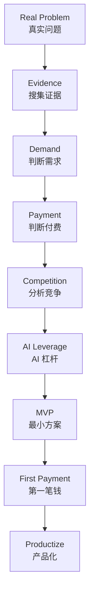

# Market Scout

> **Turn Real Problems into the First Payment.**
> 从真实问题出发，验证需求，找到第一笔钱。

Market Scout 是一个 **AI Agent Skill**（市场侦察与商业验证工作流），帮你把「一个真实问题」推进到「第一笔真实收入」。

**它不是"AI 赚钱项目生成器"。** 它不先问"AI 能做什么赚钱"，而是先问：

> **谁遇到了什么问题？为什么愿意付钱解决？**

然后判断：**AI 能否让我更低成本、更快地解决它？**

---

## 这是什么 / 解决什么问题

- **这是什么**：一个可被其他 Agent 调用的 Skill（技能包），覆盖「发现问题 → 搜集证据 → 验证需求 → 验证付费 → 分析竞争 → 用 AI 低成本解决 → 拿第一笔钱」的完整流程。
- **解决什么问题**：很多人想做副业 / 创业，但习惯"先想产品再找用户"，或"先开发再验证"。Market Scout 强制你先验证、再收费、再产品化，避免在没人付费的假设上浪费时间。
- **核心原则**：先验证，再开发。**研究不是终点，拿到第一笔钱才是。**

## 核心工作流



一句话：**真实问题 → 证据 → 需求 → 付费 → 竞争 → AI 杠杆 → MVP → 第一笔钱 → 产品化。**
每一步都用**证据**推动；没有证据就停下来补证据（Search First），而不是硬造机会。

## Quick Start（快速使用）

装好后，直接对你的 AI 说下面任意一句话就能触发（中英文均可）：

| 你想做什么 | 你可以这样说 |
|---|---|
| 找一个值得验证的真实需求 | "帮我找一个值得验证的真实需求" |
| 分析视频有没有商机 | "分析这个视频有没有商业机会" |
| 分析评论区有没有需求 | "分析这个评论区有没有真实需求" |
| 判断一个想法能不能赚钱 | "我发现一个问题，这个能不能赚钱？" |
| 验证需求并找第一位客户 | "帮我验证这个需求，并尝试找到第一位客户" |
| 准备开干 / 拿第一单 | "帮我拿第一单" / "我准备做了" |

更多触发词（中文）：`帮我找市场` · `继续深挖` · `寻找竞争对手` · `寻找类似需求` · `这个能不能用 AI`。完整触发表见 `SKILL.md`。

## Why Market Scout?

| 传统 AI Idea Generator | **Market Scout** |
|---|---|
| AI 能做什么 → 从"能力"出发 | **用户有什么真实问题** → 从"问题"出发 |
| 先想产品 | **先验证问题** |
| 先开发 | **先找用户** |
| 假设市场 | **搜索真实证据** |
| 输出项目清单 | **推进第一笔钱** |
| 尽量给机会 | **允许明确判断"不建议继续"** |

## 核心机制（Skill 逻辑，保持不变的）

- **Search First（三类搜索）**：Problem Search（有人遇到这问题？）→ Solution Search（现在怎么解决？）→ Payment Search（有人为此付钱吗？）
- **Evidence Chain（证据链）**：原始证据 → 观察 → 推断 → 假设 → 验证，禁止"一条评论直接得出强商业结论"
- **Evidence Level**：A 已验证需求 / B 潜在需求 / C 假设需求
- **Opportunity Lifecycle**：`HYPOTHESIS → DEMAND_CONFIRMED → MARKET_CONFIRMED → PAYMENT_VALIDATION → CUSTOMER_FOUND → FIRST_PAYMENT → REPEATED_DELIVERY → STANDARDIZED → AUTOMATED → PRODUCTIZED`
- **三种工作模式**：Quick（快速判断） / Research（完整 Market Scan） / Execution（直接拿第一单）
- **CUSTOMER_FOUND ≠ FIRST_PAYMENT**：愿意付钱只是验证信号，**FIRST_PAYMENT 必须实际收到真实付款**
- **Stop Conditions**：证据不足、无付费行为、AI 无优势时，允许明确说【不建议继续】
- **Sell Result First, Productize Later**：先"人工 + AI"卖结果，再谈自动化与产品化

## 安装与使用

- **方式一（拖拽安装）**：把 `market-scout.skill` 或 `market-scout.zip` 拖进 AI 客户端的技能安装入口。
- **方式二（手动）**：解压后放入技能目录，保证存在 `market-scout/SKILL.md`。
- **验证版本**：打开 `SKILL.md`，搜索 `CUSTOMER_FOUND` 和 `FIRST_PAYMENT`，两个都在即 v1.1 最新版。
- **完整中文使用说明**：见 `USER_GUIDE.md`。

## 文件结构

```
market-scout/
├── SKILL.md                        # 核心：工作流、模式、规则、决策树
├── README.md                       # 本说明
├── USER_GUIDE.md                   # 用户使用说明（中文）
├── LICENSE                         # MIT
├── .gitignore
├── references/                     # 6 个方法论文档（证据链/三类搜索/状态机等）
├── templates/                      # 5 个可填写模板（问题卡片/证据卡片/报告等）
└── examples/                       # 3 个流程示例（含完整从问题到第一笔钱的案例）
```

## 示例（演示方法，数据为示意）

- `examples/real-world-problem.md` — **完整 v1.1 运行示例**：Quick → Research（三类搜索+证据链）→ Execution（第一笔钱）+ 状态机推进
- `examples/video-analysis.md` — 视频反向市场分析
- `examples/comment-analysis.md` — 评论区需求挖掘

> 注：`examples/` 中的数据均为**演示用示意数据**，只展示方法，不代表真实市场结论。

## License

[MIT](LICENSE) © 2026 kio831
